# Jarkom_Modul5_Lapres_C04

### Anggota Kelompok C04 :
#### 05111840000029 - Khofifah Nurlaela
#### 05111840000053 - Yulia Niza
<br>

## A. Topologi
Menyusun topologi seperti pada gambar berikut :
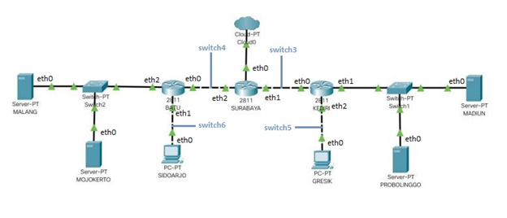

**Switch**
```
uml_switch -unix switch1 > /dev/null < /dev/null &
uml_switch -unix switch2 > /dev/null < /dev/null &
uml_switch -unix switch3 > /dev/null < /dev/null &
uml_switch -unix switch4 > /dev/null < /dev/null &
uml_switch -unix switch5 > /dev/null < /dev/null &
uml_switch -unix switch6 > /dev/null < /dev/null &
```
**Router**
```
xterm -T SURABAYA -e linux ubd0=SURABAYA,jarkom umid=SURABAYA eth0=tuntap,,,10.151.76.21 eth1=daemon,,,switch3 eth2=daemon,,,switch4 mem=96M &
xterm -T KEDIRI -e linux ubd0=KEDIRI,jarkom umid=KEDIRI eth0=daemon,,,switch3 eth1=daemon,,,switch1 eth2=daemon,,,switch5 mem=96M &
xterm -T BATU -e linux ubd0=BATU,jarkom umid=BATU eth0=daemon,,,switch4 eth1=daemon,,,switch6 eth2=daemon,,,switch2 mem=96M &
```
**Server**
```
xterm -T MALANG -e linux ubd0=MALANG,jarkom umid=MALANG eth0=daemon,,,switch2 mem=128M &
xterm -T MOJOKERTO -e linux ubd0=MOJOKERTO,jarkom umid=MOJOKERTO eth0=daemon,,,switch2 mem=128M &
xterm -T MADIUN -e linux ubd0=MADIUN,jarkom umid=MADIUN eth0=daemon,,,switch1 mem=128M &
xterm -T PROBOLINGGO -e linux ubd0=PROBOLINGGO,jarkom umid=PROBOLINGGO eth0=daemon,,,switch1 mem=128M &

```
**Client**
```
xterm -T SIDOARJO -e linux ubd0=SIDOARJO,jarkom umid=SIDOARJO eth0=daemon,,,switch6 mem=96M &
xterm -T GRESIK -e linux ubd0=GRESIK,jarkom umid=GRESIK eth0=daemon,,,switch5 mem=96M &
```


## B. Subnetting dengan VLSM
Menentukan jumlah subnet dalam topologi
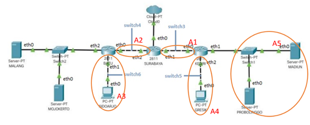

Melakukan perhitungan IP menggunakan metode VLSM
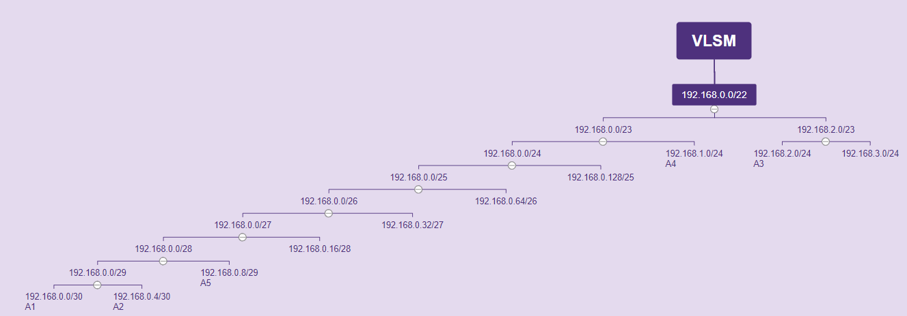

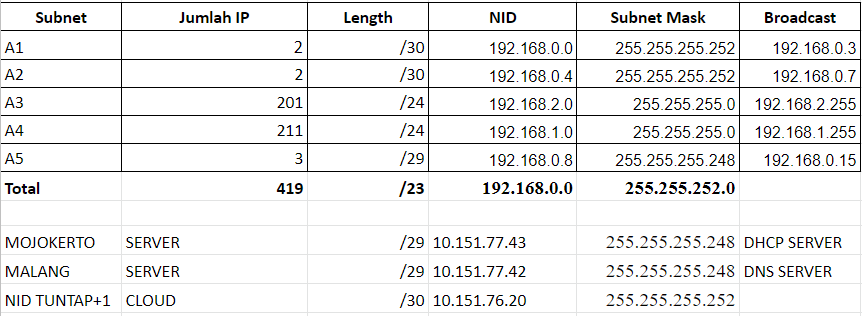
Lalu memasukkannya pada interfaces setiap uml pada dengan cara ```nano /etc/network/interfaces```


**SURABAYA**
```auto lo
iface lo inet loopback

#cloud
auto eth0
iface eth0 inet static
address 10.151.76.22
netmask 255.255.255.252
gateway 10.151.76.21

#switch3
auto eth1
iface eth1 inet static
address 192.168.0.1
netmask 255.255.255.252

#switch4
auto eth2
iface eth2 inet static
address 192.168.0.5
netmask 255.255.255.252
```

**KEDIRI**
```auto lo
iface lo inet loopback

#switch3
auto eth0
iface eth0 inet static
address 192.168.0.2
netmask 255.255.255.252
gateway 192.168.0.1

#switch1
auto eth1
iface eth1 inet static
address 192.168.0.9
netmask 255.255.255.248

#switch5
auto eth2
iface eth2 inet static
address 192.168.1.1
netmask 255.255.255.0
```

**BATU**
```auto lo
iface lo inet loopback

#switch4
auto eth0
iface eth0 inet static
address 192.168.0.6
netmask 255.255.255.252
gateway 192.168.0.5

#switch6
auto eth1
iface eth1 inet static
address 192.168.2.1
netmask 255.255.255.0

#switch2
auto eth2
iface eth2 inet static
address 10.151.77.41
netmask 255.255.255.248
```

**MALANG**
```auto lo
iface lo inet loopback

#switch2
auto eth0
iface eth0 inet static
address 10.151.77.42
netmask 255.255.255.248
gateway 10.151.77.41
```

**MOJOKERTO**
```
auto lo
iface lo inet loopback

#switch2
auto eth0
iface eth0 inet static
address 10.151.77.43
netmask 255.255.255.248
gateway 10.151.77.41
```

**MADIUN**
```auto lo
iface lo inet loopback

#switch1
auto eth0
iface eth0 inet static
address 192.168.0.10
netmask 255.255.255.248
gateway 192.168.0.9
```

**PROBOLINGGO**
```
auto lo
iface lo inet loopback

#switch1
auto eth0
iface eth0 inet static
address 192.168.0.11
netmask 255.255.255.248
gateway 192.168.0.9
```

**SIDOARJO**
```auto lo
iface lo inet loopback

#switch6
auto eth0
iface eth0 inet static
address 192.168.2.2
netmask 255.255.255.0
gateway 192.168.2.1

GRESIK A4
auto lo
iface lo inet loopback

#switch5
auto eth0
iface eth0 inet static
address 192.168.1.2
netmask 255.255.255.0
gateway 192.168.1.1
```

Lalu melakukan ```service networking restart``` pada setiap uml.


## C. Routing
- Pada setiap router jangan lupa melakukan setting sysctl, dengan mengetikkan perintah `nano /etc/sysctl.conf`.
- Hilangkan tanda pagar (#) pada bagian `net.ipv4.ip_forward=1`. Kemudian ketikkan `sysctl -p` untuk mengaktifkan perubahan yang ada.
- Routing dilakukan pada setiap device router dengan membuat file **route.sh**, syntax :


**SURABAYA**
```
#to Malang & Mojokerto via Batu
ip route add 10.151.77.40/29 via 192.168.0.6
#to Sidoarjo via Batu
ip route add 192.168.2.0/24 via 192.168.0.6
#to Gresik via Kediri
ip route add 192.168.1.0/24 via 192.168.0.2
#to Probolinggo & Madiun via Kediri
ip route add 192.168.0.8/29 via 192.168.0.2
```
**BATU**
```
route add -net 0.0.0.0 netmask 0.0.0.0 gw 192.168.0.5
```

**KEDIRI**
```
route add -net 0.0.0.0 netmask 0.0.0.0 gw 192.168.0.1

```
- Jalankan **route.sh**.

## D. DHCP
### 1. Memberikan IP pada subnet SIDOARJO dan GRESIK secara dinamis 

Dilakukan dengan cara ``` nano /etc/network/interfaces``` pada SIDOARJO dan GRESIK

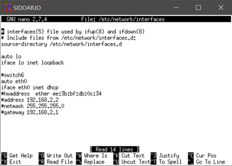

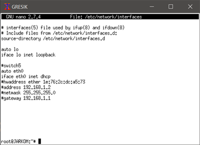

### 2. Konfigurasi DHCP server MOJOKERTO 
- Install dhcp-server ```apt-get install isc-dhcp-server```
- Konfigurasi interfaces ```nano /etc/default/isc-dhcp-server``` dengan ```INTERFACESv4="eth0"```
- Konfigurasi pada dhcp-server  ```nano /etc/dhcp/dhcpd.conf ``` seperti pada gambar berikut :

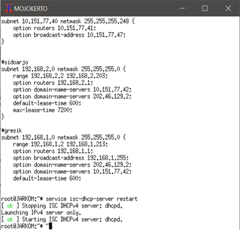

- Restart dengan cara  ```service isc-dhcp-server restart```

### 3. DHCP Relay
Dilakukan pada router KEDIRI, BATU, SURABAYA
- Install dhcp-relay  : ```apt-get install isc-dhcp-relay```
- Konfigurasi interface dhcp-relay : ```nano /etc/default/isc-dhcp-relay ```
- Atur agar server mengarah ke MOJOKERTO dengan ```SERVERS="10.151.77.43"``` dan ```INTERFACESv4``` seperti pada gambar dibawah :


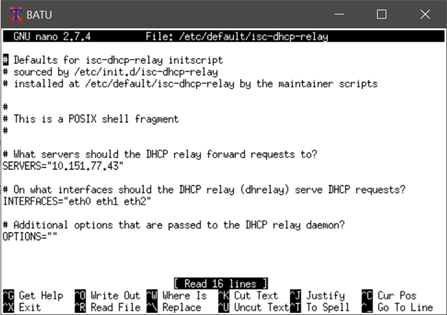

- Lalu Restart : ```service isc-dhcp-relay restart```


## Soal 
### 1. Agar topologi yang kalian buat dapat mengakses keluar, kalian diminta untuk mengkonfigurasi SURABAYA menggunakan iptables, namun Bibah tidak ingin kalian menggunakan MASQUERADE.

- Pada UML **Surabaya** membuat file dengan perintah `nano no1.sh` yang berisi:
```iptables -t nat -A POSTROUTING -s 192.168.0.0/16 -o eth0 -j SNAT --to-source 10.151.76.22```
- Kemudian, jalankan file tersebut dengan perintah `bash no1.sh`.
- Untuk mengeceknya, kami tes dengan `ping google.com` pada semua UML.
- Bukti screenshoot:

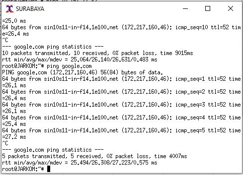 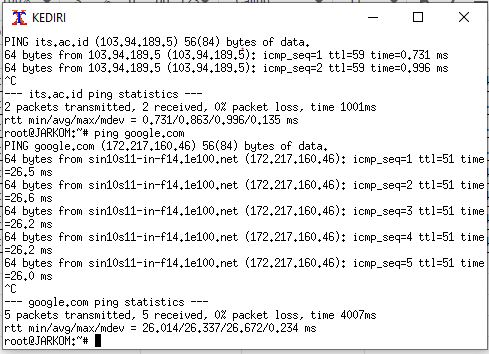
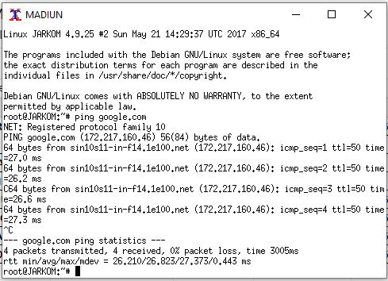 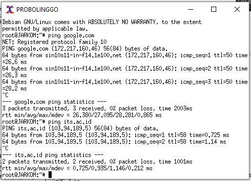
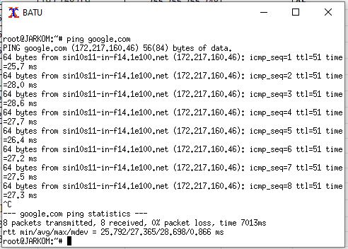 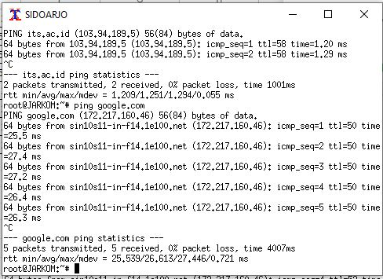
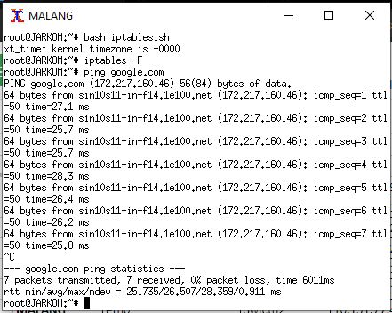 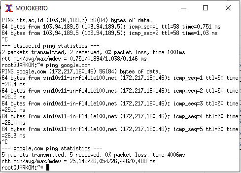

### 2. Kalian diminta untuk mendrop semua akses SSH dari luar Topologi (UML) Kalian pada server yang memiliki ip DMZ (DHCP dan DNS SERVER) pada SURABAYA demi menjaga keamanan.

- Pada UML **Surabaya** membuat file dengan perintah `nano no2.sh` yang berisi:
```iptables -A FORWARD -d 10.151.77.40/29 -i eth0 -p tcp --dport 22 -j DROP```
- Kemudian, jalankan file tersebut dengan perintah `bash no2.sh`.
- Untuk mengeceknya, di UML **Malang** ketik perintah `nc -l -p 22`.
- Buka terminal Putty, ketikkan printah `nc 10.151.77.42 22`. Di terminal Putty ini ketikan ‘apapun’, nanti akan muncul hasil yang sama di UML Malang.
- Bukti screenshoot:
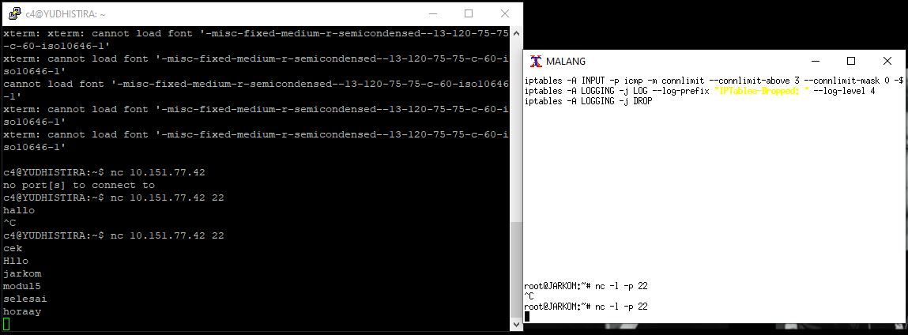

### 3. Karena tim kalian maksimal terdiri dari 3 orang, Bibah meminta kalian untuk membatasi DHCP dan DNS server hanya boleh menerima maksimal 3 koneksi ICMP secara bersamaan yang berasal dari mana saja menggunakan iptables pada masing masing server, selebihnya akan di DROP.

- Pada UML **Malang**  dan **Mojokerto** membuat file dengan perintah `nano no3.sh` yang berisi:
```iptables -A INPUT -p icmp -m connlimit --connlimit-above 3 --connlimit-mask 0 -j DROP```
- Kemudian, jalankan file tersebut dengan perintah `bash no3.sh`.
- Untuk mengeceknya, lakukan ping ke IP Malang atau IP Mojokerto dari 4 UML berbeda.
- Hasilnya nanti salah satu UML tidak bisa melakukan ping ke IP Malang atau IP Mojokerto.
- Bukti screenshoot, ini contoh melakukan ping ke IP Malang dengan mengetikkan perinta `ping 10.151.77.42`:
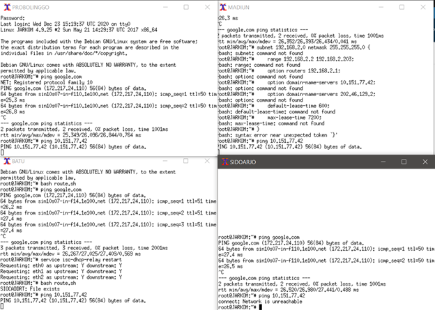

### kemudian kalian diminta untuk membatasi akses ke MALANG yang berasal dari SUBNET SIDOARJO dan SUBNET GRESIK dengan peraturan sebagai berikut:
### 4. Akses dari subnet SIDOARJO hanya diperbolehkan pada pukul 07.00 - 17.00 pada hari Senin sampai Jumat.

- Pada UML **Malang** membuat file dengan perintah `nano no4.sh` yang berisi:
```
iptables -A INPUT -s 192.168.2.0/24 -m time --timestart 07:00 --timestop 17:00 --weekdays Mon,Tue,Wed,Thu,Fri -j ACCEPT
iptables -A INPUT -s 192.168.2.0/24 -j REJECT 
```
- Kemudian, jalankan file tersebut dengan perintah `bash no4.sh`.
- Untuk mengeceknya, lakukan ping ke **IP Malang** `ping 10.151.77.42` dari UML **Sidoarjo**.
- Kita bisa mengakses pada hari Senin-Jumat pada pukul 07:00-17:00.
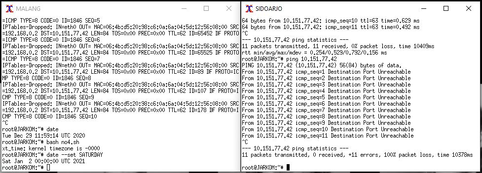
- Tetapi selain waktu tersebut akses akan direject, seperti gambar berikut:
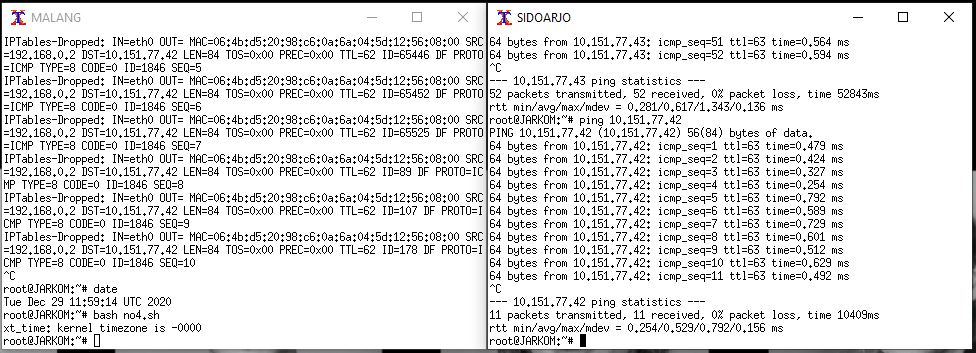

### 5. Akses dari subnet GRESIK hanya diperbolehkan pada pukul 17.00 hingga pukul 07.00 setiap harinya.

- Pada UML **Malang** membuat file dengan perintah `nano no5.sh` yang berisi:
``` iptables -A INPUT -s 192.168.1.0/24 -m time --timestart 07:00 --timestop 17:00 -j REJECT ```
- Kemudian, jalankan file tersebut dengan perintah `bash no5.sh`.
- Untuk mengeceknya, lakukan ping ke **IP Malang** `ping 10.151.77.42` dari UML **Gresik**.
- Jika kita mengakses pada pukul 07:00-17:00, akses akan direject.
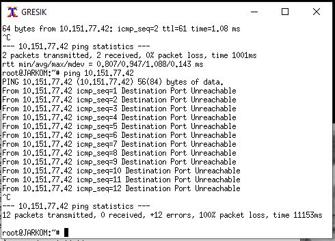
- Tetapi selain waktu tersebut akses akan diaccept.


### 6. SURABAYA disetting sehingga setiap request dari client yang mengakses DNS Server akan didistribusikan secara bergantian pada PROBOLINGGO port 80 dan MADIUN port 80.

- Pada UML **Surabaya** membuat file dengan perintah `nano no6.sh` yang berisi:
```
iptables -A PREROUTING -t nat -p tcp -d 10.151.77.42 --dport 80 -j DNAT --to-destination 192.168.0.11:80 -m statistuc --mode nth --every 2 --packet 0
iptables -A PREROUTING -t nat -p tcp -d 10.151.77.42 --dport 80 -j DNAT --to-destination 192.168.0.10:80

iptables -t nat -A POSTROUTING -p tcp -d 192.168.0.10 --dport 80 -j SNAT --to-source 10.151.77.42:80
iptables -t nat -A POSTROUTING -p tcp -d 192.168.0.11 --dport 80 -j SNAT --to-source 10.151.77.42:80
```
- Kemudian, jalankan file tersebut dengan perintah `bash no6.sh`.
- Untuk mengeceknya, di UML **Probolinggo** dan **Madiun** ketik perintah `nc -l -p 80`.
- Buka 2 terminal Putty, ketikkan printah `nc 10.151.77.42 22` pada kedua terminal. Di terminal Putty ini ketikan ‘apapun’, nanti akan muncul hasil yang sama di **Probolinggo** dan **Madiun**.
- Bukti screenshoot:
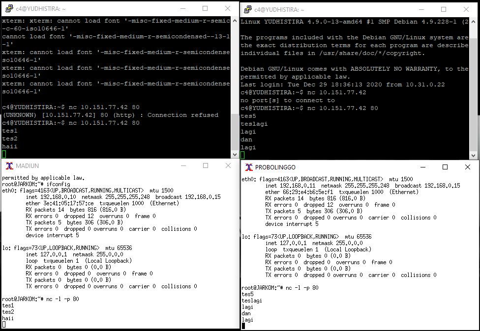

### 7. Bibah ingin agar semua paket didrop oleh firewall (dalam topologi) tercatat dalam log pada setiap UML yang memiliki aturan drop.

- Pada UML **Surabaya** membuat file dengan perintah `nano no7.sh` yang berisi:

``` 
iptables -N LOGGING
iptables -A FORWARD -d 10.151.77.40/29 -i eth0 -p tcp --dport 22 -j LOGGING
iptables -A LOGGING -j LOG --log-prefix "IPTables-Dropped: " --log-level 4
iptables -A LOGGING -j DROP 
```

- Pada UML **Malang** membuat file dengan perintah `nano no7.sh` yang berisi:
``` 
iptables -N LOGGING
iptables -A INPUT -p icmp -m connlimit --connlimit-above 3 --connlimit-mask 0 -j LOGGING
iptables -A LOGGING -j LOG --log-prefix "IPTables-Dropped: " --log-level 4
iptables -A LOGGING -j DROP 
```

- Pada UML **Mojokerto** membuat file dengan perintah `nano no7.sh` yang berisi:
``` 
iptables -N LOGGING
iptables -A INPUT -p icmp -m connlimit --connlimit-above 3 --connlimit-mask 0 -j LOGGING
iptables -A LOGGING -j LOG --log-prefix "IPTables-Dropped: " --log-level 4
iptables -A LOGGING -j DROP 
```

- Kemudian, jalankan file tersebut dengan perintah `bash no7.sh`.
- Semua catatan yang didrop akan otomatis muncul pada UML yang bersangkutan.	


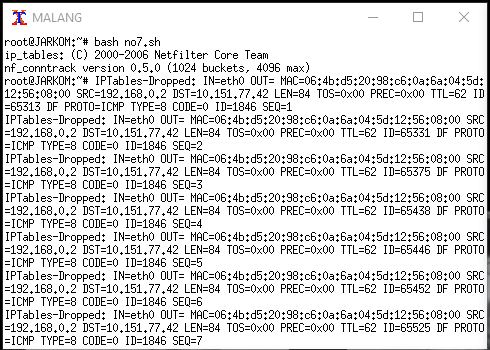

